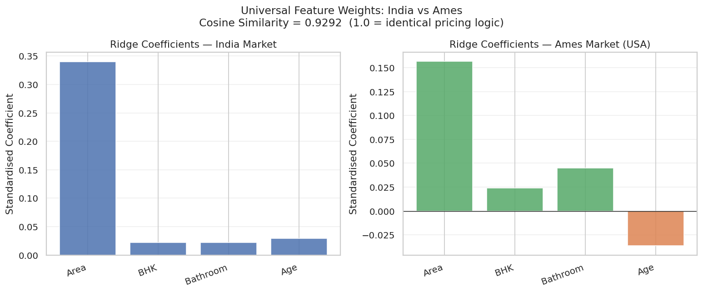
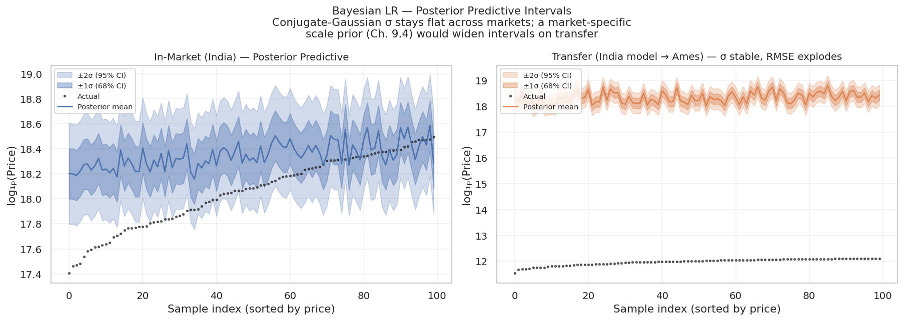
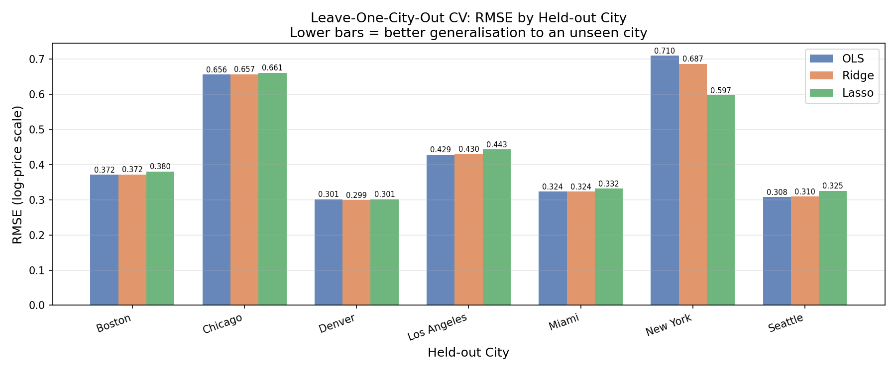

# Cross-Market Transfer Learning & Bayesian House Price Prediction

Can a house-price model learned in one market predict prices in another?
This project answers that in three phases, building every estimator from the
linear-algebra up (normal equations, closed-form Ridge, coordinate-descent
Lasso, conjugate Bayesian linear regression) rather than calling a library `fit`.

Course project for **MA2221 – Mathematics for Machine Learning**, Mahindra University.
Theory follows *Mathematics for Machine Learning* (Deisenroth, Faisal & Ong, 2020).

| Phase | Question | Method | Headline result |
|---|---|---|---|
| [1. Regularised regression](phase1_regularised_regression/) | How well do OLS, Ridge and Lasso price houses in one Indian market? | 5-fold CV, λ sweep, regularisation paths | 5-fold RMSE ≈ **0.123** (log-price) for all three; Lasso keeps Area + city tier as main drivers |
| [2. City-stratified generalisation](phase2_city_stratified/) | Does the model generalise to a city it has never seen? | Leave-One-City-Out CV, PCA of cities | Held-out RMSE **0.31–0.71**; New York is hardest, and Lasso cuts its error most |
| [3. Cross-market transfer](phase3_cross_market_transfer/) | Do pricing rules transfer from India to the USA (Ames, Iowa)? | Feature alignment, weight-vector cosine similarity, Bayesian LR | Coefficient **shape** transfers (cosine similarity **0.93**), but price **level** does not (transfer RMSE ≈ 6.3) |

## Key findings

**1. What transfers is the shape of pricing, not the level.**
Ridge weight vectors trained separately on India and Ames point in almost the
same direction (cosine similarity 0.93): area dominates, bedrooms and bathrooms
add a little. Yet India→Ames transfer RMSE is ~6.3 on the log scale. That gap is
almost exactly the difference in mean log-price between the markets
(18.80 for rupees − 12.48 for dollars = 6.32), so the error is an
intercept/currency offset, not a failure of the learned relationships.



**2. Bayesian uncertainty does not know it is out of distribution.**
The conjugate-Gaussian posterior gives the same predictive σ (≈0.20) on Ames as
on India, even though the transfer error is ~31× that σ. Predictive variance depends on the
feature geometry (XᵀX), which is identical after standardisation, not on the
shift in target scale. A market-specific scale prior would be needed for
honest intervals.



**3. Regularisation pays off where the unseen market is most different.**
With Leave-One-City-Out CV, OLS wins 5 of 7 held-out cities, but Lasso has the
lowest mean RMSE (0.434 vs 0.443) because it cuts New York's error from 0.71
to 0.60. New York is also the outlier in the PCA of city profiles, i.e. the
city furthest from the training distribution.



## Repository structure

```
├── phase1_regularised_regression/
│   ├── house_price_regression.py    OLS / Ridge (scratch) + Lasso, 5-fold CV, 8 plots
│   ├── figures/                     EDA and model plots from the Kaggle run
│   └── results/output.txt           console output of that run
├── phase2_city_stratified/
│   ├── city_stratified_pipeline.py  LOCO-CV, scratch Lasso (coordinate descent), PCA
│   ├── figures/                     4 plots
│   ├── report/phase2_report.pdf     written report
│   └── results/output.txt
├── phase3_cross_market_transfer/
│   ├── cross_market_transfer.py     feature alignment, transfer, Bayesian LR
│   ├── figures/                     8 plots
│   └── results/output.txt
├── requirements.txt
└── README.md
```

## Running it

```bash
pip install -r requirements.txt

# Phase 1 needs the Kaggle CSV (see below) saved as
# phase1_regularised_regression/india_house_price.csv
python phase1_regularised_regression/house_price_regression.py

# Phases 2 and 3 are self-contained
python phase2_city_stratified/city_stratified_pipeline.py
python phase3_cross_market_transfer/cross_market_transfer.py
```

Each script writes its plots to its own `figures/` folder. Seeds are fixed
(`42`), so reruns reproduce the committed results. Phases 2 and 3 run in
under 10 seconds each.

## Data

| Phase | Data | Source |
|---|---|---|
| 1 | India House Price Prediction (500 rows, 8 cities) | [Kaggle – ankushpanday1](https://www.kaggle.com/datasets/ankushpanday1/india-house-price-prediction), CC0. Not committed; download it to run Phase 1. |
| 2 | 7-city US dataset (4,650 rows) | **Synthetic**, generated to mirror the 7-Cities + Metro Combined structure, because that dataset is not freely redistributable. |
| 3 | India + Ames, Iowa (500 + 1,460 rows) | **Synthetic proxies**: the India set replicates the Phase 1 schema, and the Ames set replicates the columns of the Ames Housing dataset (De Cock, 2011) with a price model calibrated to its ~$180k median. |

Because Phases 2 and 3 use simulated data, their results show how the methods
behave under known, controlled market differences; they are not empirical
claims about real US housing markets. Swapping in the real CSVs only requires
replacing the generator call in each script's data section.

## Bugs found and fixed in Phase 3

The Phase 3 script's docstring documents each fix. In short:

1. Missing furnishing values were stored as the string `'None'` instead of a real null (NumPy fixed-width string dtype).
2. City sample counts summed to 450, silently capping `n=500`.
3. The Ames→India Bayesian score reused the India in-market score.
4. A plot title claimed intervals widen on transfer; they do not.
5. A misleading percentage change in interval width was removed.
6. The "Ames in-market" Bayesian bar used the India-trained model, showing a transfer error (6.3) instead of the in-market one (0.15).

## Next steps

- Normalise the target per market (subtract each market's mean log-price) to measure slope transfer separately from the level offset.
- Replace the synthetic Ames proxy with the real Ames Housing data.
- Add a hierarchical prior with a market-level scale term so Bayesian intervals widen under shift.

## Theory map

| Method | MML chapter |
|---|---|
| OLS as MLE, normal equation | Ch. 9 |
| Ridge / Lasso as MAP with Gaussian / Laplace priors | Ch. 9 |
| Conjugate Bayesian linear regression, posterior predictive | Ch. 9.3–9.4 |
| PCA via SVD | Ch. 10 |
| Regularisation paths, convex optimisation | Ch. 7 |

## Author

**Pearl Mendapara** — B.Tech Computing & Mathematics, Mahindra University ·
B.Sc. Data Science, IIT Madras
